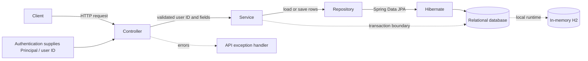

# Notification Preferences API

A small Spring Boot API for retrieving and updating a user's email, SMS, and push notification preferences. This phase stores preferences only; it does not send notifications.

## Architecture



The code is organized under `com.example.notification`:

- `controller`: HTTP routes and request validation.
- `service`: preference defaults and transactional update behavior.
- `repository`: Spring Data JPA queries.
- `persistence`: JPA entity mapping.
- `domain`: supported channel enum.
- `dto`: API request and response types.

The controller returns a DTO, not a persistence entity. `ApiExceptionHandler` centralizes error responses and logs unexpected operational failures.

## API

Both endpoints use the authenticated principal's name as `userId`; callers do not submit a user ID.

### Read preferences

```http
GET /users/me/notification-preferences
```

Returns effective values. A missing database row means that channel is enabled by default:

```json
{
  "emailEnabled": true,
  "smsEnabled": true,
  "pushEnabled": true
}
```

### Partially update preferences

```http
PATCH /users/me/notification-preferences
Content-Type: application/json
```

Supply one or more fields. Omitted fields are unchanged; values must be booleans.

```json
{
  "smsEnabled": false
}
```

The response is `200 OK` with the full effective preference representation. Repeating a patch with the same boolean values is state-idempotent.

### Status and errors

- `200 OK`: GET or successful PATCH.
- `400 Bad Request`: empty/malformed body, unknown field, `null`, or non-boolean value.
- `401 Unauthorized`: no principal is available.
- `409 Conflict`: a database integrity conflict. A concurrent first insert for the same user/channel can cause one request to fail; retrying the state-setting PATCH is safe.
- `415 Unsupported Media Type`: request is not JSON.
- `500 Internal Server Error`: unexpected persistence or server failure. Internal exception details are logged server-side and not included in the response.

The current conflict handler maps any JPA `DataIntegrityViolationException` to `409`; if additional persistence constraints are added, classify expected conflicts separately.

## Technical Walkthrough

**GET:** The controller requires a nonblank `Principal` and passes its name to the service. The service initializes all three channels to `true`, loads saved rows for that user through the JPA repository, and replaces defaults for channels with stored values. It builds a response DTO, which Spring serializes as JSON.

**PATCH:** The controller accepts a flat JSON object and maps only `emailEnabled`, `smsEnabled`, and `pushEnabled` to the supported channel enum. It rejects empty, unknown, null, and non-boolean values. The service starts a transaction, loads existing rows, updates the requested channels or creates missing rows, saves them, then returns the effective preferences. The database unique constraint on `(user_id, channel)` protects against duplicate rows.

**Storage:** `NotificationPreferenceEntity` maps `user_id`, `channel`, and `enabled`. The generated `id` is the entity key; `(user_id, channel)` is unique. Channel values are stored as enum names and constrained to `EMAIL`, `SMS`, or `PUSH`. `schema.sql` defines the local schema, and Hibernate validates entity mappings at startup.

## Run Locally

Prerequisites: JDK 17 or later. The Maven wrapper downloads dependencies as needed.

```powershell
.\mvnw.cmd spring-boot:run
```

The local configuration uses an in-memory H2 database. Data is lost when the application stops. The API requires a request `Principal`; this project does not yet include authentication middleware, so a plain unauthenticated request receives `401`. The tests provide a synthetic principal directly.

## Test

Run the focused application and API tests:

```powershell
.\mvnw.cmd -Dtest=NotificationApplicationTests test
```

The tests cover default GET values, saved-value overrides, partial PATCH persistence, invalid and unsupported request bodies, unauthenticated requests, and sanitized centralized error responses.

## Current Scope and Deployment Notes

- Notification delivery, channel integrations, caching, and asynchronous messaging are not implemented.
- Authentication is expected to be supplied by the hosting application; wire it so the authenticated user ID is available as the request `Principal`.
- H2 and `schema.sql` are for local development. Select a production database and add versioned migrations before deployment.
- Concurrent writes to existing rows are last-committed-write-wins. Simultaneous first inserts for the same preference can produce `409 Conflict`; automatic retry is not implemented.
- `design.md` records the detailed design decisions and follow-up considerations.
